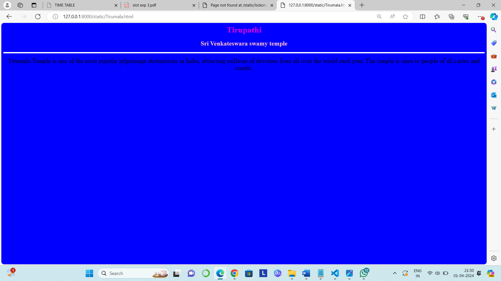
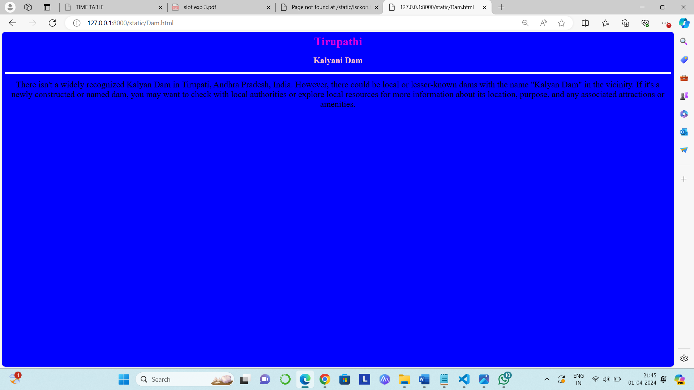
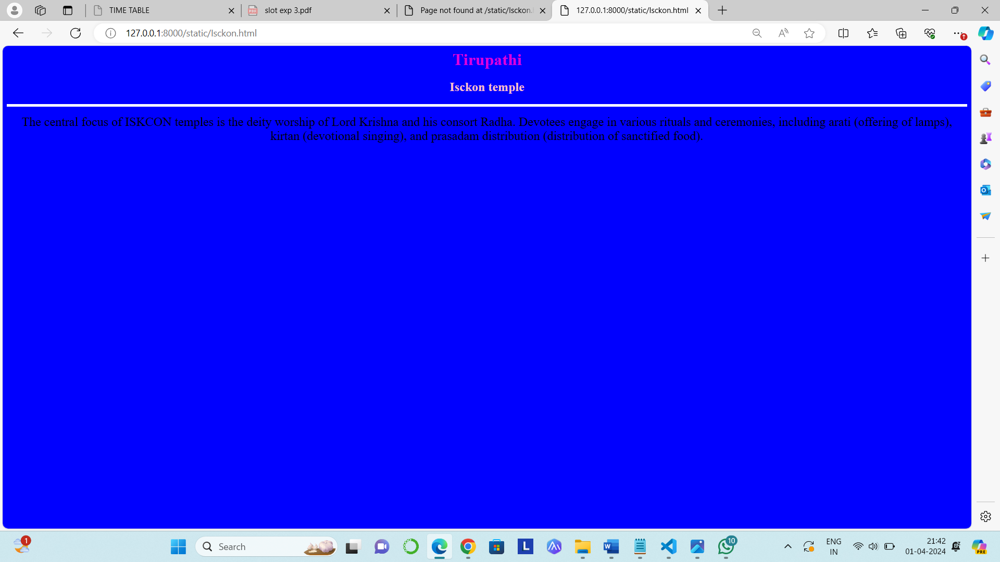

# Ex04 Places Around Me
## Date: 01/04/2024

## AIM
To develop a website to display details about the places around my house.

## DESIGN STEPS

### STEP 1
Create a Django admin interface.

### STEP 2
Download your city map from Google.

### STEP 3
Using ```<map>``` tag name the map.

### STEP 4
Create clickable regions in the image using ```<area>``` tag.

### STEP 5
Write HTML programs for all the regions identified.

### STEP 6
Execute the programs and publish them.

## CODE
```

<html>
    <title>Mycity</title>
    <body bgcolor="White">
        <h1 align="center"><font color="black">Tirupathi</font></h1>
        <h3 align="center">
            <font color="Pink">K.pujitha (212223240074)</font></h3>
        <center>
            
            <map name="MyCity">
                    <area shape="rect" coords="360,230,410,260" href="Tirumala.html" title="Sri Venkateswara swamy temple">     
                    <area shape="rect" coords="750,270,840,350" href="Isckon.html" title="Isckon temple">
                    <area shape="rect" coords="400,600,510,650" href="Waterfalls.html" title="Ramapuram Waterfalls">
                    <area shape="rect" coords="1100,240,900,300" href="Dam.html" title="Kalyani Dam">
                    <area shape="rect" coords="810,300,750,350" href="forest.html" title="Seshachalam forest">
        </center>
       
    </body>
</html>
    

<html>
    <h1 align="center">
        <font face="Times New Roman" color=" dark green" size="6">Tirupathi</font>
    </h1>
    <h3 align="center">
        <font face="Times New Roman" color="pink" size="5.5">Sri Venkateswara swamy temple</font>
    </h3>
    <body bgcolor="blue" align="center">
        <hr size="5" color="white">
        <p align="center">
        <font face="Times New Roman" size="5.5">
            Tirumala Temple is one of the most popular pilgrimage destinations in India, attracting millions of devotees from all over the world each year.
             The temple is open to people of all castes and creeds. 
        </font>
        </p>
    </body>
</html>


<html>
    <h1 align="center">
        <font face="Times New Roman" color="dark green" size="6">Tirupathi</font>
    </h1>
    <h3 align="center">
        <font face="Times New Roman" color="Pink" size="5.5">Kalyani Dam</font>
    </h3>
    <body bgcolor="blue" align="center">
        <hr size="5" color="white">
        <p align="center">
        <font face="Times New Roman" size="5.5">
            There isn't a widely recognized Kalyan Dam in Tirupati, Andhra Pradesh, India. 
            However, there could be local or lesser-known dams with the name "Kalyan Dam" in the vicinity.
             If it's a newly constructed or named dam, you may want to check with local authorities or explore local resources for more information about its location, purpose, and any associated attractions or amenities.
        </font>
        </p>
    </body>
</html>


<html>
    <h1 align="center">
        <font face="Times New Roman" color=" dark green" size="6">Tirupathi</font>
    </h1>
    <h3 align="center">
        <font face="Times New Roman" color="Pink" size="5.5">ramapuram waterfalls</font>
    </h3>
    <body bgcolor="blue" align="center">
        <hr size="5" color="white">
        <p align="center">
        <font face="Times New Roman" size="5.5">
            The waterfall is renowned for its natural beauty, with water cascading down rocky cliffs surrounded by lush greenery.
             The area around the waterfall is characterized by pristine natural surroundings, making it a popular destination for nature lovers, photographers, and tourists seeking tranquility.
            Ramapuram Waterfalls is relatively accessible by road, and visitors can reach the site by car or public transportation. The waterfall is located about 4 kilometers from the town of Ramapuram and is well-connected to nearby towns and cities.
        </p>
    </body>
</html>


<html>
    <h1 align="center">
        <font face="Times New Roman" color=" dark green" size="6">Tirupathi</font>
    </h1>
    <h3 align="center">
        <font face="Times New Roman" color="Pink" size="5.5">Isckon temple</font>
    </h3>
    <body bgcolor="blue" align="center">
        <hr size="5" color="white">
        <p align="center">
        <font face="Times New Roman" size="5.5">
            The central focus of ISKCON temples is the deity worship of Lord Krishna and his consort Radha. 
            Devotees engage in various rituals and ceremonies, including arati (offering of lamps), kirtan (devotional singing), and prasadam distribution (distribution of sanctified food).
        </font>
        </p>
    </body>
</html>


<html>
    <h1 align="center">
        <font face="Times New Roman" color=" dark green" size="6">Tirupathi</font>
    </h1>
    <h3 align="center">
        <font face="Times New Roman" color="pink" size="5.5">Seshachalam forest</font>
    </h3>
    <body bgcolor="blue" align="center">
        <hr size="5" color="white">
        <p align="center">
        <font face="Times New Roman" size="5.5">
            The Seshachalam Forest is situated in the Eastern Ghats mountain range, which runs parallel to the eastern coast of India. 
            It covers a vast area with rugged terrain, deep valleys, and steep slopes, making it an ecologically diverse region.
           The forest is known for its rich biodiversity, housing a wide variety of plant and animal species. It is home to several endemic and endangered species, including the Red Sanders (Pterocarpus santalinus) tree, which is highly valued for its red sandalwood. 
           The forest also supports diverse wildlife, including various species of mammals, birds, reptiles, and insects.
        </font>
        </p>
    </body>
</html>
```

## OUTPUT










## RESULT
The program for implementing image maps using HTML is executed successfully.
